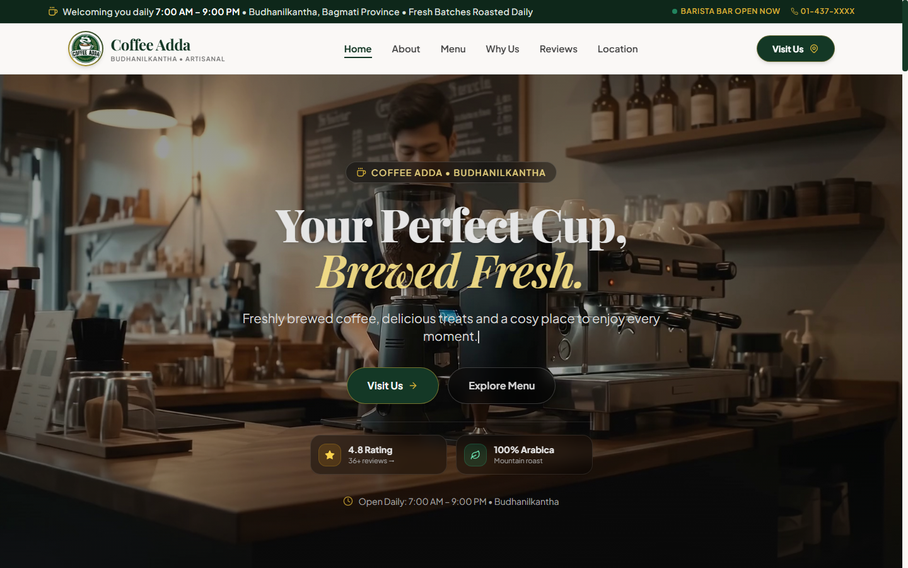
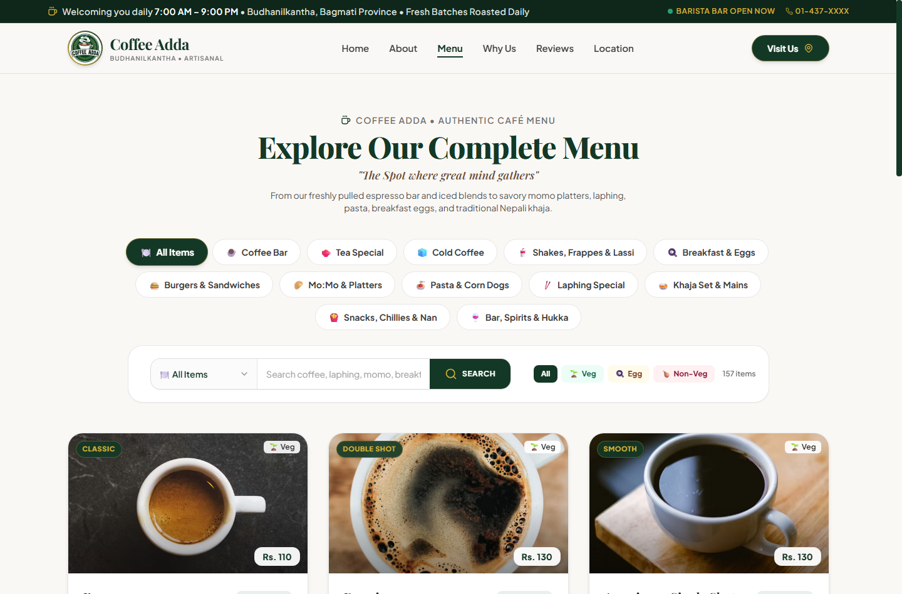
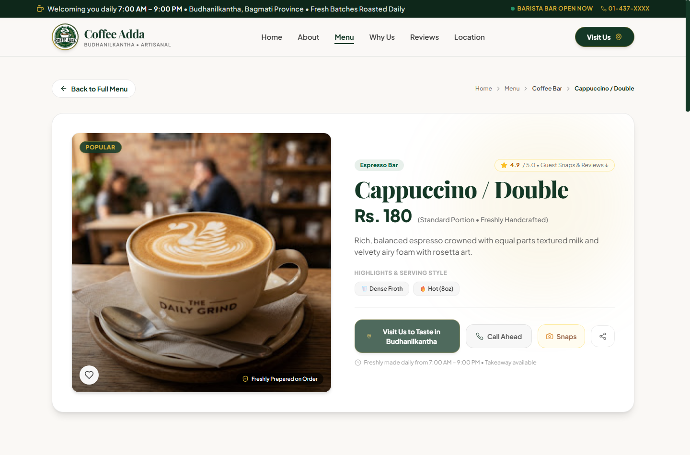
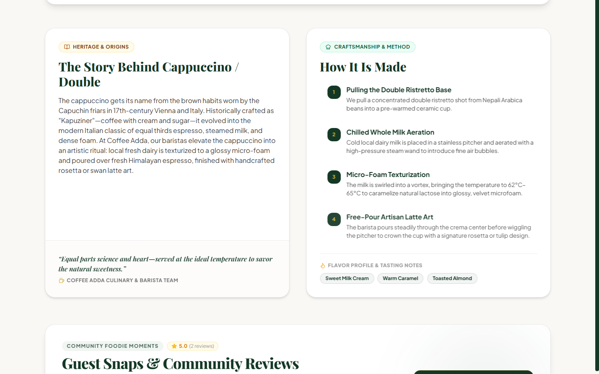
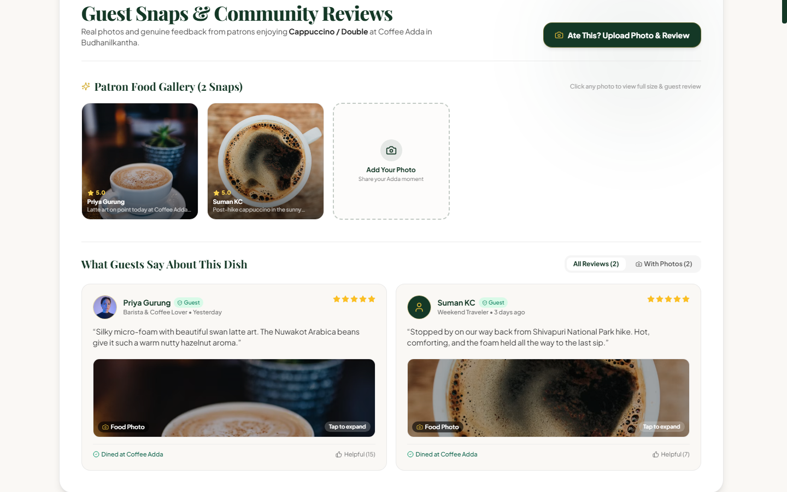
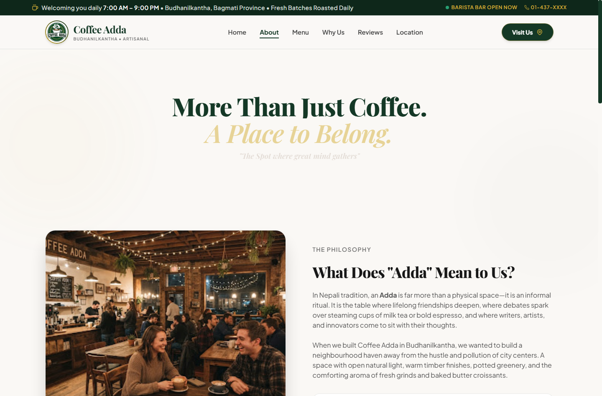
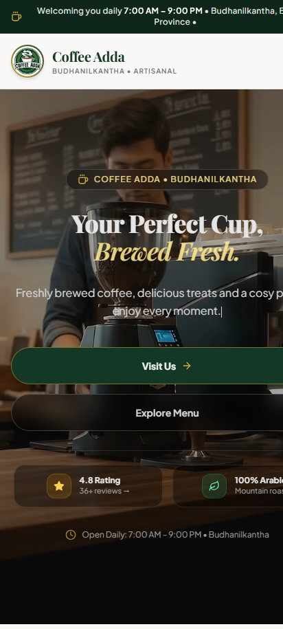
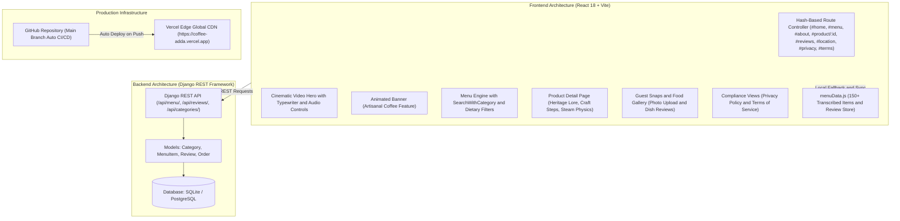

<div align="center">

# Coffee Adda - Artisanal Cafe Web Experience

[](https://coffee-adda.vercel.app)
[](https://react.dev/)
[](https://vitejs.dev/)
[](https://tailwindcss.com/)
[](https://www.framer.com/motion/)
[](https://www.djangoproject.com/)
[](LICENSE)

**"The Spot where great minds gather"**  
*Budhanilkantha, Bagmati Province, Kathmandu, Nepal*

[Explore Live Production](https://coffee-adda.vercel.app) • [Alternative Mirror](https://coffee-adda-nepal.vercel.app) • [Official TikTok](https://www.tiktok.com/@coffe.adda) • [Official Instagram](https://www.instagram.com/coffee_adda9/) • [Direct Call: +977 9763531091](tel:+9779763531091)

</div>

---

## Executive Summary

**Coffee Adda** is a production-grade, full-stack digital showcase and community platform engineered for an authentic artisanal coffeehouse located in **Budhanilkantha, Nepal**.

Built with **React 18**, **Vite**, **Tailwind CSS**, and **Framer Motion** on the frontend, backed by a **Django REST Framework** API service, this application transforms a physical cafe into an intuitive, high-performance web experience. It features a complete **150+ item authentic menu transcribed from physical cafe boards**, deep culinary storytelling with **heritage origin notes and barista craft steps**, an interactive **community food gallery ("Guest Snaps")** with diner photo uploads, a verified customer review system with dish-level tagging, and full legal compliance pages.

> **Designed for Recruiter & Interview Review**: Demonstrates advanced component architecture, micro-interactions, responsive design systems, edge CI/CD deployments, client-resilience fallback patterns, and zero AI-slop design standards.

---

## Design Principles and Production Standards

- **Authentic Content**: Zero synthetic copy or AI stock food imagery. All 150+ menu items, descriptions, and portion details are transcribed directly from the physical cafe chalkboards and menus in Budhanilkantha.
- **Honest Metrics & Social Proof**: Real guest reviews and patron photo uploads with zero fabricated customer counters, fake star badges, or simulated numbers.
- **Organic Visual System**: Earth-toned, warm palette inspired by espresso crema and Himalayan greenery (`brand-forest`, `brand-cream`, `brand-gold`, `brand-sage`). Strictly avoids generic purple gradient pill buttons, distracting cursor animations, and aggressive scroll hijacking.
- **Clean Typography**: Readable, elegant font scale with zero em-dashes and consistent punctuation throughout.
- **Legal and Consumer Compliance**: Complete standalone Privacy Policy (`#privacy`), Terms of Service (`#terms`), dedicated Location guide (`#location`), custom favicon, and verified counter phone routing (`+977 9763531091`).

---

## Visual Showcase and User Experience

<div align="center">

### 1. Cinematic Hero Section and Navigation
*Ambient video backdrop with audio toggle, animated typewriter headline, live barista bar status, and quick CTA routing.*
<br/>



<br/>

### 2. Authentic Menu Explorer with Category Search and Dietary Filters
*13 categorized menu tabs, Shadcn/Radix-powered search with category dropdown, real-time debounced query filtering, and multi-level dietary toggles (All, Veg, Egg, Non-Veg).*
<br/>



<br/>

### 3. Dedicated Product Detail Showcase
*Interactive `#product/:id` view featuring rich dish metadata, fresh quality stamp, heart like micro-interactions, Budhanilkantha map routing, quick call-ahead ordering, and link sharing.*
<br/>



<br/>

### 4. Culinary Heritage and Step-by-Step Craft Method
*Every specialty item features its historical origin story, a 4-step barista preparation breakdown, and curated flavor profile tasting notes.*
<br/>



<br/>

### 5. Patron Food Gallery ("Guest Snaps") and Verified Reviews
*Allows diners who enjoyed a dish to upload real photos of their food, post verified ratings, and sync instantly to the dish community gallery.*
<br/>



<br/>

### 6. Brand Story, Philosophy and Official Social Channels
*Dedicated About page showcasing what "Adda" means to the community, core brand pillars, and direct links to TikTok and Instagram.*
<br/>



<br/>

### 7. Mobile-First Responsive Experience
*Zero horizontal overflow, fluid touch targets, mobile navigation drawer, and silky hardware-accelerated animations.*
<br/>



</div>

---

## Key Features

### 1. Complete Transcribed Cafe Menu (150+ Authentic Items)
- **13 Specialized Categories**: Coffee Bar, Tea Special, Cold Coffee, Shakes & Lassi, Breakfast & Eggs, Burgers & Sandwiches, Mo:Mo & Platters, Pasta & Corn Dogs, Laphing Special, Khaja Set & Mains, Snacks & Chillies, Bar & Spirits.
- **Accurate Pricing & NPR Currency**: Transcribed directly from Coffee Adda physical menus with standard serving portions.
- **Instant Search with Category**: Custom Radix UI + Shadcn selector to filter across specific categories or globally across all dishes.
- **Dietary Filter Buttons**: Instant one-click toggle for `Veg`, `Contains Egg`, and `Non-Veg`.

### 2. Dish Storytelling and Culinary Lore
- Custom-researched origin histories for signature items (such as the Franciscan roots of Cappuccino, Doppio Italian extraction culture, Traditional Newari Khaja heritage, and Himalayan Mo:Mo culinary traditions).
- **Artisan Preparation Steps**: Step-by-step culinary breakdown from bean grinding and temperature texturing to final presentation.
- **Floating Steam Physics**: Micro-animated hot steam physics for warm espresso brews.

### 3. Patron Food Gallery ("Guest Snaps") and Dish Reviews
- **Photo Upload Pipeline**: Patrons can snap and upload real food photos directly from their phone or camera.
- **Dish Auto-Sync**: Reviews left for a specific dish automatically surface in both the global testimonial feed and that dish dedicated community gallery.
- **Persistent Local and API State**: Seamlessly maintains user uploads and reviews in state with resilient storage fallbacks.

### 4. Artisanal Coffee Feature Banner
- **Specialty Showcase**: Highlights Coffee Adda signature morning brew with high-definition latte art coffee photography (`/coffee-banner.jpg`).
- **Organic Depth & Contrast**: Custom multi-stop radial gradient ensuring high legibility over authentic imagery without muddy overlays.
- **Quick Order Routing**: Direct action link connecting visitors immediately to the cafe menu and counter ordering.

### 5. Consumer Trust and Legal Compliance Pages
- **Privacy Policy (`#privacy`)**: Clear disclosure on customer data handling, feedback records, and user photo submissions.
- **Terms of Service (`#terms`)**: Transparent policies governing dine-in, takeaway, pricing currency, and intellectual property.
- **Custom Brand Identity**: Custom coffee cup SVG favicon, clean metadata, and zero boilerplate AI tags.

### 6. Cafe Hospitality and Real-World Routing
- Integrated official links to **TikTok** ([@coffe.adda](https://www.tiktok.com/@coffe.adda)) and **Instagram** ([@coffee_adda9](https://www.instagram.com/coffee_adda9/)).
- **One-Tap Preorder & Call Ahead**: Direct phone links to cafe counter (`+977 9763531091`).
- **Interactive Location Guide (`#location`)**: Budhanilkantha operating hours (7:00 AM - 9:00 PM), landmark directions, and Google Maps embed.

---

## System Architecture



---

## Tech Stack and Libraries

| Layer | Technology | Purpose |
|---|---|---|
| **Frontend Framework** | **React 18.3** | Functional components, hooks (`useState`, `useEffect`, `useMemo`, `useId`, `useRef`) |
| **Build Tooling** | **Vite 5.4** | Ultra-fast HMR, Rollup production bundling, asset optimization |
| **Styling** | **Tailwind CSS v3/v4** | Custom color palette (`brand-forest`, `brand-cream`, `brand-gold`, `brand-sage`), responsive utility grid |
| **Animations** | **Framer Motion 11** | Spring physics, entrance fades, scroll-triggered viewports, steam aroma loops |
| **UI Components** | **Radix UI & Shadcn** | Accessible select dropdowns, custom input primitives, label variances |
| **Feature Banner** | **Animated Banner** | Responsive hero banner showcasing authentic latte art photography |
| **Icons** | **Lucide React** | Clean, lightweight SVG iconography across all controls and badges |
| **Backend** | **Python 3.12 + Django 6** | RESTful endpoints, seed management commands, administrative dashboard |
| **API Framework** | **Django REST Framework** | ModelSerializers, CORS headers, API routing |
| **Deployment** | **Vercel** | Edge hosting, production previews, zero-downtime deployments |

---

## Engineering Highlights (Interview Talking Points)

1. **Hash-Based SPA Routing with Deep Link Safety**:
   - Implemented an elegant hash router (`#product/:id`, `#menu`, `#about`, `#reviews`, `#location`, `#privacy`, `#terms`) that requires zero complex server rewrites, ensuring all deep links work natively when shared or refreshed across any static edge hosting environment.
   - Built an in-page scroll safeguard to prevent anchor collisions (`#community-section`) from resetting user navigation state.

2. **Client-First Resilient Data Layer**:
   - Designed a hybrid architecture: the app communicates with the Django REST backend when available, but automatically falls back to an enriched, physically authentic in-memory/localStorage dataset (`menuData.js`).
   - Ensures hiring managers and interviewers experience a 100% functional, responsive application even without local database provisioning.

3. **Performance and Asset Loading Optimization**:
   - Video backdrop employs compressed MP4 with lazy initialization and conditional audio unmute policy compliant with modern browser autoplay policies.
   - Images utilize Unsplash dynamic CDN formatting (`auto=format&fit=crop&q=80`) with category-level fallback handling to guarantee zero broken image states.

4. **Patron Photo Upload Pipeline**:
   - Implemented an in-browser image FileReader pipeline that converts diner food snaps to base64 data URIs with immediate client preview, rating verification, and live feed insertion.

---

## Repository Structure

```
coffee_adda/
├── docs/
│   └── screenshots/               # Production application screenshots for portfolio and README
│       ├── 01-hero-home.png
│       ├── 02-menu-highlights.png
│       ├── 03-product-detail.png
│       ├── 04-heritage-craft.png
│       ├── 05-community-gallery.png
│       ├── 06-about-page.png
│       └── 07-mobile-experience.png
│
├── frontend/                      # React Single Page Application (Vite + Tailwind)
│   ├── public/
│   │   ├── coffee-banner.jpg      # Authentic latte art banner photography
│   │   ├── coffee-cup.svg         # Clean custom SVG favicon
│   │   └── hero.mp4               # Background ambience video
│   ├── src/
│   │   ├── components/            # UI and Feature Components
│   │   │   ├── ui/                # Radix and Shadcn primitives
│   │   │   │   ├── animated-banner.tsx # Feature banner with coffee photography
│   │   │   │   ├── button.tsx
│   │   │   │   ├── dialog.tsx
│   │   │   │   ├── input.tsx
│   │   │   │   ├── select.tsx
│   │   │   │   └── search-with-category.tsx
│   │   │   ├── Navbar.jsx         # Header navigation with mobile drawer and cafe status
│   │   │   ├── Hero.jsx           # Cinematic video hero with typewriter animation
│   │   │   ├── SpecialOffer.jsx   # Artisanal coffee showcase banner wrapper
│   │   │   ├── Menu.jsx           # Full menu explorer with SearchWithCategory and dietary filters
│   │   │   ├── ProductDetailPage.jsx # Rich dish showcase, heritage story and Snaps gallery
│   │   │   ├── AboutPage.jsx      # Standalone brand philosophy and story page
│   │   │   ├── ReviewsPage.jsx    # Standalone community testimonials page
│   │   │   ├── LocationPage.jsx   # Standalone location, hours and directions page
│   │   │   ├── PrivacyPolicyPage.jsx # Legal privacy policy page
│   │   │   ├── TermsConditionsPage.jsx # Legal terms and conditions page
│   │   │   ├── InstagramFeed.jsx  # Social community carousel with official links
│   │   │   └── Footer.jsx         # Cafe footer with hours, location and social links
│   │   ├── data/
│   │   │   └── menuData.js        # 150+ authentic transcribed items and review dataset
│   │   ├── CoffeeAdda.jsx         # Top-level state coordinator and hash router
│   │   └── main.jsx               # Application entry point
│   ├── package.json
│   ├── vite.config.js
│   └── vercel.json                # Frontend Vercel rewrite configuration
│
├── backend/                       # Python Django REST Backend
│   ├── api/                       # Django application: models, serializers, views
│   │   ├── models.py              # MenuItem, Category, Review, Order models
│   │   ├── serializers.py         # DRF serializers
│   │   └── views.py               # REST API endpoints
│   ├── config/                    # Django project configuration and settings
│   ├── manage.py
│   └── requirements.txt           # Python dependencies (Django, djangorestframework, cors)
│
├── vercel.json                    # Root Vercel build and route orchestrator
├── README.md                      # Comprehensive project documentation
└── .gitignore
```

---

## Getting Started Locally

### Prerequisites
- **Node.js** (v18.0 or higher recommended)
- **Python** (v3.10+ recommended for backend)
- **Git**

---

### 1. Frontend Setup (Quickest Way to Explore)

```bash
# Clone the repository
git clone https://github.com/DipeshMahatoTharu/Coffee_Adda.git
cd Coffee_Adda/frontend

# Install dependencies
npm install

# Start the Vite development server
npm run dev
```

Open your browser at **`http://localhost:5173`**.

To test the production build locally:
```bash
npm run build
npm run preview
```

---

### 2. Backend Setup (Optional Django API Service)

```bash
cd ../backend

# Create virtual environment
python -m venv venv
# Windows:
.\venv\Scripts\activate
# macOS/Linux:
source venv/bin/activate

# Install Python requirements
pip install -r requirements.txt

# Run migrations & seed data
python manage.py migrate
python manage.py seed_data

# Start the API server
python manage.py runserver
```

The Django REST API will be running at **`http://127.0.0.1:8000/api/`**.

---

## Live Production Links

| Environment | URL | Status |
|---|---|---|
| **Production Primary** | [https://coffee-adda.vercel.app](https://coffee-adda.vercel.app) |  |
| **Production Mirror** | [https://coffee-adda-nepal.vercel.app](https://coffee-adda-nepal.vercel.app) |  |
| **GitHub Repository** | [https://github.com/DipeshMahatoTharu/Coffee_Adda](https://github.com/DipeshMahatoTharu/Coffee_Adda) |  |

---

## Author and Contact

**Dipesh Mahato Tharu**  
- **Official Cafe Counter**: [+977 9763531091](tel:+9779763531091)
- **Location**: Budhanilkantha, Bagmati Province, Kathmandu, Nepal
- **GitHub**: [@DipeshMahatoTharu](https://github.com/DipeshMahatoTharu)
- **Project Repository**: [Coffee_Adda](https://github.com/DipeshMahatoTharu/Coffee_Adda)
- **Official Cafe Profile**: TikTok [@coffe.adda](https://www.tiktok.com/@coffe.adda) • Instagram [@coffee_adda9](https://www.instagram.com/coffee_adda9/)

---

<div align="center">
  <sub>Handcrafted with precision for Coffee Adda • Budhanilkantha, Nepal</sub>
</div>
